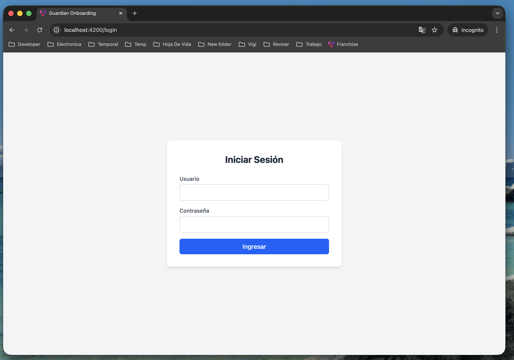
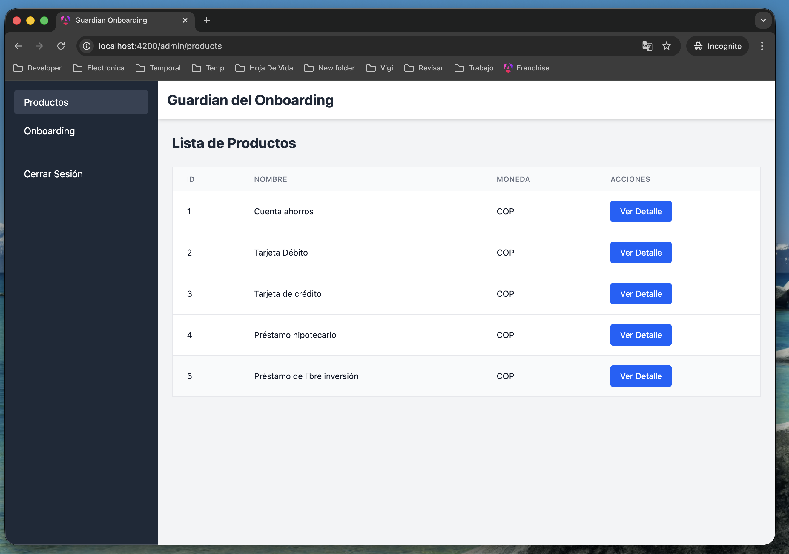
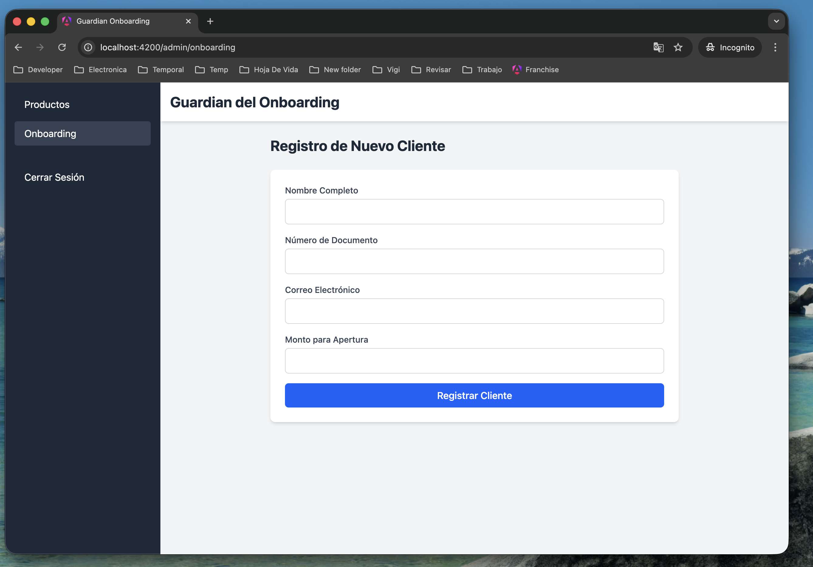

# Guardian Onboarding

Aplicación web desarrollada con Angular para la gestión de onboarding de clientes del Banco Caja Social.

## Requisitos Previos

- Node.js (versión 20 o superior)

## Instalación

1. Clonar el repositorio o navegar a la carpeta del proyecto:
```bash
cd guardian-onboarding-frontend-angular
```

2. Instalar las dependencias:
```bash
npm install
```

## Configuración

### Variables de Entorno

El proyecto utiliza un archivo de configuración de entorno ubicado en `src/environments/environment.ts`.

Para cambiar la URL del backend, edita el archivo:

```typescript
export const environment = {
    production: false,
    apiUrl: 'http://localhost:3001'  // Cambia esta URL según tu configuración
};
```

**Nota:** Si el backend está corriendo en un puerto diferente o en otro servidor, actualiza el valor de `apiUrl` en este archivo.

## Ejecutar el Proyecto

Para iniciar el servidor de desarrollo:

```bash
npm start
```

O también puedes usar:

```bash
ng serve
```

La aplicación estará disponible en `http://localhost:4200`

## Estructura de la Aplicación

### Páginas

La aplicación cuenta con las siguientes páginas:

#### 1. Login (`/login`)
Página de autenticación donde los usuarios pueden iniciar sesión con su usuario y contraseña. Al autenticarse exitosamente, se guarda el token JWT en `sessionStorage` y se redirige a la página de productos.



#### 2. Lista y Detalle de Productos (`/admin/products`)
Página que muestra una tabla con todos los productos disponibles. Cada producto muestra su ID, nombre y moneda. Al hacer clic en "Ver Detalle", se abre un modal con la información completa del producto.



#### 3. Registro de Clientes (`/admin/onboarding`)
Formulario para registrar nuevos clientes. Permite ingresar:
- Nombre completo
- Número de documento
- Correo electrónico
- Monto para apertura

Al completar el registro exitosamente, se muestra un modal con el ID de onboarding y el estado del registro.




## Tecnologías Utilizadas

- **Angular 21** - Framework principal
- **TypeScript** - Lenguaje de programación
- **Tailwind CSS** - Framework de estilos
- **RxJS** - Programación reactiva

